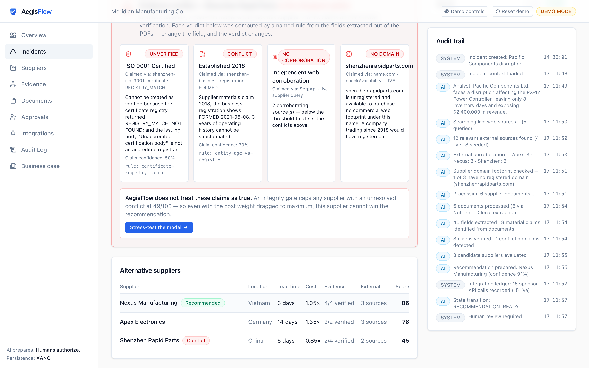
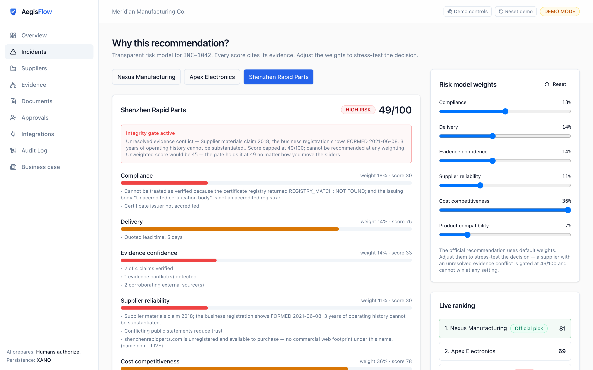
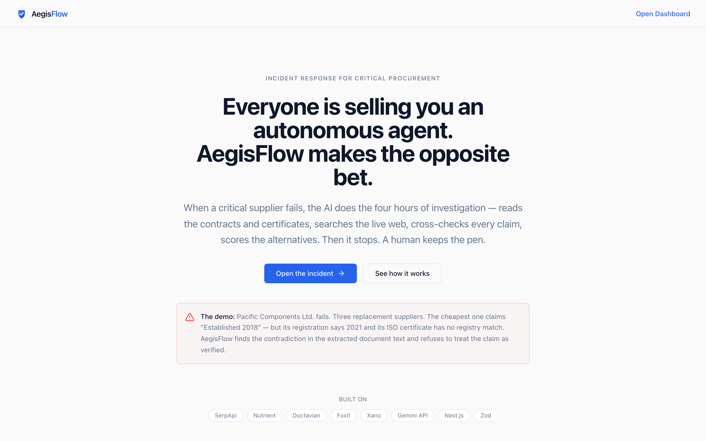
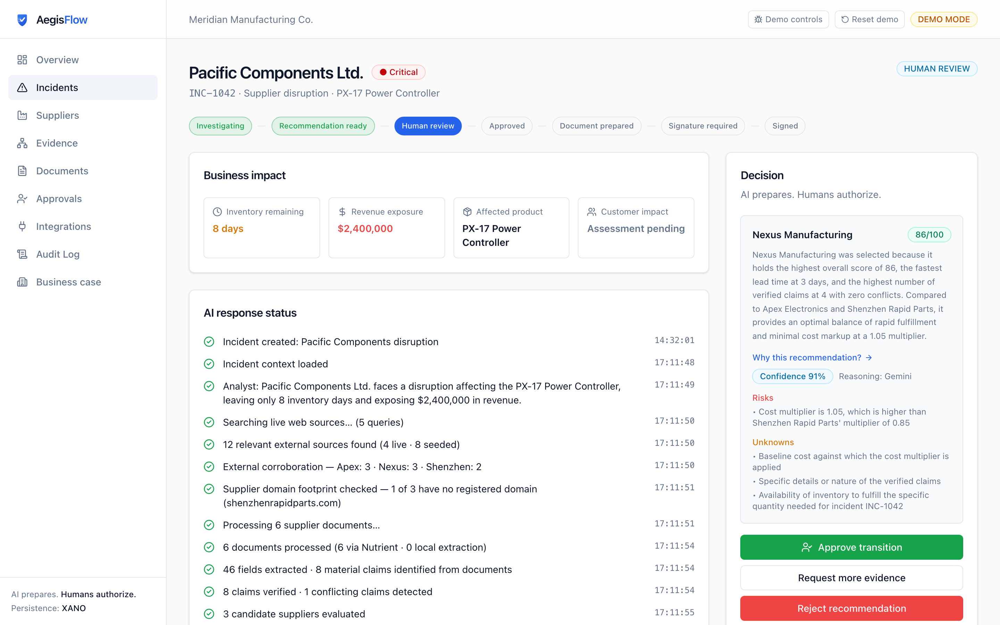
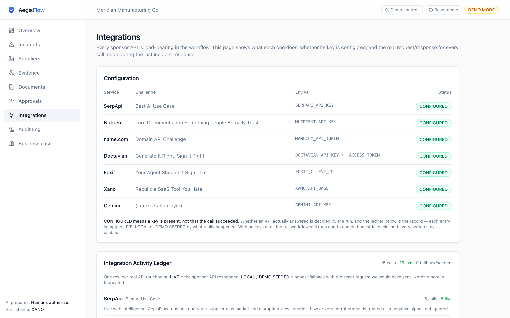
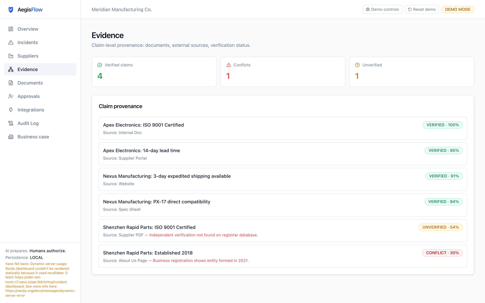
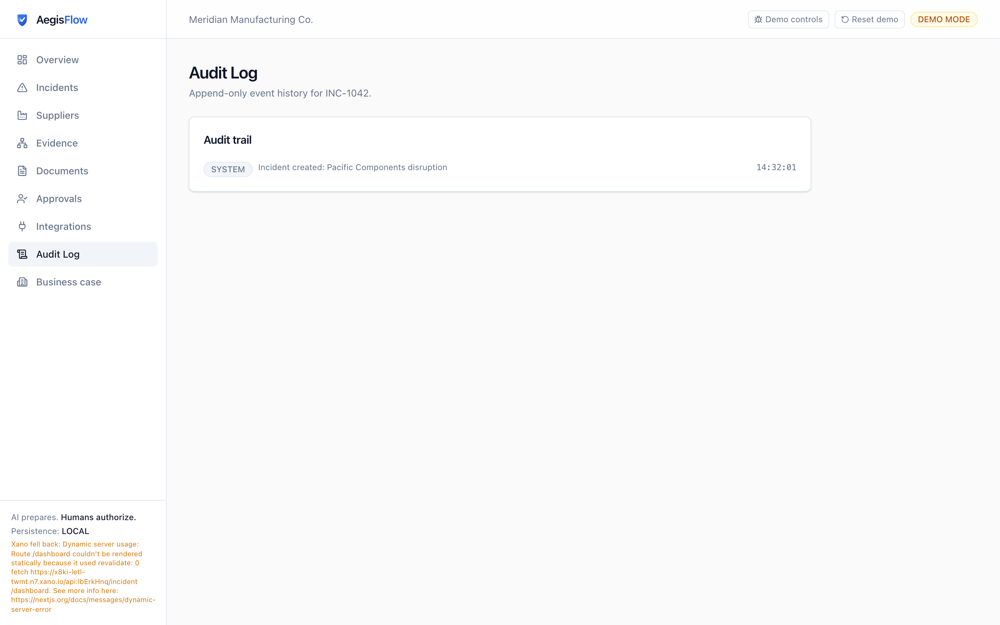
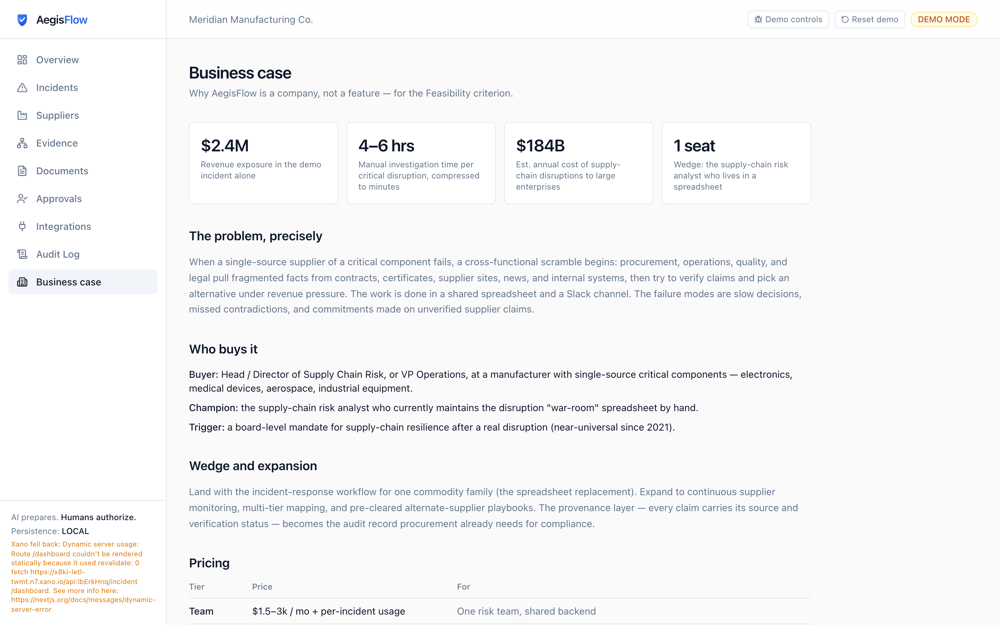
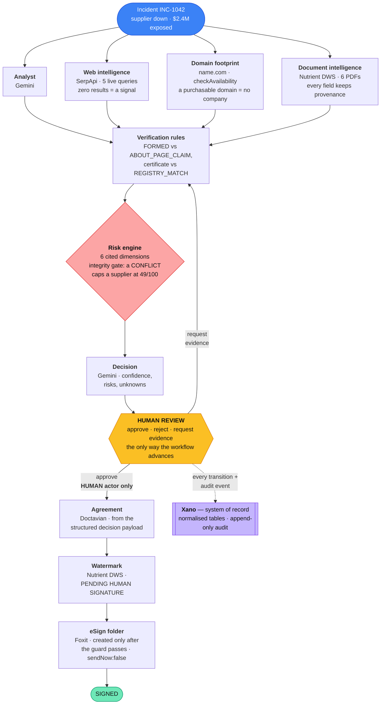

<div align="center">

<picture>
  <source media="(prefers-color-scheme: dark)" srcset="docs/brand/wordmark-dark.png">
  
</picture>

**AI incident response for critical procurement. The AI does the four hours of investigation — a human keeps the pen.**

*DevNetwork [API + Cloud + AI] Hackathon 2026 — SerpApi · Nutrient · Doctavian · Foxit · name.com · Xano*

[Live demo](https://aegisflow-ai.vercel.app) · [Architecture](#architecture) · [Verify the integrations](#verify-it-in-one-command)

</div>

---

## The problem

Every vendor is selling you an autonomous procurement agent. Nobody in a regulated
supply chain will let one commit spend.

When a single-source supplier of a critical component fails, a cross-functional
scramble begins. Procurement, operations, quality and legal pull fragmented facts
from contracts, certificates, supplier sites, news and internal systems, then try
to verify claims and choose an alternative — in a shared spreadsheet, under revenue
pressure. The failure modes are slow decisions, missed contradictions, and
commitments made on unverified supplier claims. One missed eight-day stockout on a
$2.4M line dwarfs any software budget.

AegisFlow makes the opposite bet from the autonomous-agent pitch. The AI runs the
whole investigation — reads the documents, searches the live web, cross-checks
every claim, scores the alternatives — and then **stops** at a human. The
consequential moves (approve, reject, sign) are reserved for a person, enforced by
a state machine rather than a prompt.

## What it does

Open `INC-1042` and press **Run Response**. A network of agents then:

| # | Stage | What happens | API |
|---|-------|--------------|-----|
| 1 | **Analyse** | Frames the disruption from the incident facts | Gemini |
| 2 | **Search** | One query per supplier + market and disruption-news queries; **zero results is a signal**, not a blank | SerpApi |
| 3 | **Extract** | Pulls the fields every claim's provenance points back to, from the six supplier PDFs | Nutrient DWS |
| 3b | **Domain footprint** | Is the supplier's own domain still available to buy? A company trading since 2018 registered its domain | name.com |
| 4 | **Verify** | Named rules compare extracted fields against each other — the founding year a supplier claims vs the `FORMED` date on its registration, a certificate against its `REGISTRY_MATCH`. Change the field, the verdict changes | — |
| 5 | **Score** | Six transparent risk dimensions, each citing its evidence, with an **integrity gate** a weighting can't beat | — |
| 6 | **Decide** | Evidence-backed recommendation with confidence, risks and unknowns | Gemini |
| — | **Human review** | Approve / reject / request-more-evidence — the only way the workflow advances | — |
| 7 | **Generate** | The Emergency Supplier Transition Agreement, from the structured decision payload | Doctavian |
| 8 | **Watermark** | Stamps the agreement `PENDING HUMAN SIGNATURE` before anyone sees it | Nutrient DWS |
| 9 | **Sign** | eSign folder created — only after a named human-authorization guard passes | Foxit |
| — | **Record** | Normalised `incident → supplier → claim` tables + an append-only audit stream | Xano |

Every API call along the way — live, local fallback, or seeded — lands in an open
**Integration Activity Ledger** (`/integrations`) with its real request and
response. Every data path in the UI is tagged `LIVE`, `LOCAL` or `DEMO SEEDED`.
Nothing is fabricated.

### Sanity — the supplier evidence graph

Sanity is the app's durable evidence graph. One investigation is modelled as
linked `evidenceIncident`, `evidenceSupplier`, `evidenceClaim`,
`evidenceDocument`, `evidenceSource`, and `evidenceDecision` documents. This is
not a search index: a contradictory claim, the registration field that refutes it,
and the human recommendation survive as separate, queryable records. The Evidence
screen uses GROQ to read the graph when configured and labels its honest local
mirror otherwise.

The current Sanity project is `af8ykvwc`, dataset `production`. To run it:

```bash
# add these to .env.local — never commit the write token
NEXT_PUBLIC_SANITY_PROJECT_ID=af8ykvwc
NEXT_PUBLIC_SANITY_DATASET=production
SANITY_API_WRITE_TOKEN=replace-with-an-editor-token

# seed baseline data, then launch the separate Studio
node scripts/seed-sanity.mjs
cd sanity && npm install && npm run dev
```

Set the dataset to public for the challenge's required public dataset access, and
add `http://localhost:3000` plus the deployed app URL to **Sanity Manage → API →
CORS origins**. A live investigation then upserts the entire graph at the end of
verification; without a token, the workflow stays fully usable and records an
honest `LOCAL` Sanity ledger entry.

### The golden scenario

`INC-1042`: Pacific Components Ltd. fails; the PX-17 Power Controller is at risk;
8 days of inventory; $2.4M exposure. Three alternatives. The cheapest —
Shenzhen Rapid Parts, at 0.85× baseline — claims *"Established 2018"*, but its
business registration shows **2021** and its ISO 9001 certificate has **no
registry match**. AegisFlow discovers the contradiction in the extracted document
text, marks the claims `CONFLICT` / `UNVERIFIED`, and refuses to treat them as
true. Recommended supplier: Nexus Manufacturing, on delivery evidence and clean
verification.

## Screenshots

**Four independent systems disagree with the cheapest supplier — and each verdict
names the rule that produced it.**



**Drag the cost weight to maximum. The conflicted supplier still caps at 49/100.**



| | |
|---|---|
|  **The bet** |  **The incident console** |
|  **Every sponsor call on the record** |  **Claim-level provenance** |
|  **Append-only audit trail** |  **Why it is a company** |

Captured against a live run — 15/15 ledger calls LIVE, all six documents through
Nutrient DWS. Regenerate with `node scripts/capture-screenshots.mjs` (read-only;
add `--local` to point at localhost).

---

## SerpApi — Best AI Use Case

AegisFlow uses live web search for **verification, not retrieval**. The novel part
is what it does with a *miss*: a live query that returns zero organic results is a
first-class outcome, recorded in the ledger and fed to the risk model as absence
of corroboration.

- **The call:** [`serpapi/client.ts:15`](integrations/serpapi/client.ts#L15) — `GET https://serpapi.com/search`, 8s timeout, at runtime
- **Wired in:** [`web-intelligence.ts:63`](lib/agents/web-intelligence.ts#L63) — five queries per incident, run concurrently
- **Invoked by the pipeline:** [`investigation.ts`](lib/orchestration/investigation.ts) — stage 2 of every response, before any document is read
- **Proof at runtime:** `/integrations` shows all five calls with their real `organic_results`; the investigation console reads `20 live · 0 seeded`; a zero-result query is annotated *"absence of corroboration (a negative signal)"*

## Nutrient — Turn Documents Into Something People Actually Trust

Nutrient DWS is load-bearing on **both ends** of the workflow. On ingestion it
extracts the fields every claim's provenance chain points back to. On output it
watermarks the generated agreement `PENDING HUMAN SIGNATURE` before a human ever
opens it.

- **The calls:** [`nutrient/client.ts:67`](integrations/nutrient/client.ts#L67) (extract) and [`nutrient/client.ts:125`](integrations/nutrient/client.ts#L125) (watermark) — both `POST https://api.nutrient.io/build`, Processor API
- **Wired in:** [`document-intelligence.ts`](lib/agents/document-intelligence.ts) — routes the conflict-bearing documents through DWS (`NUTRIENT_FULL=true` for all six; the free tier is 50 credits)
- **Invoked by:** stage 3 of the response, and again in [`actions.ts` `prepareDocuments`](lib/orchestration/actions.ts) after approval
- **Proof at runtime:** every fact in the *Evidence* view links to the Nutrient-extracted `documentId · field` it came from; the agreement page carries a visible `PENDING HUMAN SIGNATURE` stamp

## Doctavian — Generate It Right. Sign It Tight.

The Emergency Supplier Transition Agreement is generated from a **structured,
Zod-validated decision payload** — not a free-text prompt. The
decision → payload → document chain is visible in the UI, and the payload carries
the evidence summary (verified count, conflict count, confidence) into the
contract itself.

Doctavian's model is a *document request*, not string interpolation: data is
uploaded as a file and addressed by URN, the template is uploaded and addressed by
URN, and generation ties them together with an output spec. That suits this app,
because the thing being handed over is already a typed object.

- **The calls:** [`doctavian/client.ts`](integrations/doctavian/client.ts) — `POST /v1/documents/template/upload` and `POST /v1/documents/data/upload` in parallel (the decision payload *is* the data source), then `POST /v1/documents/document/generate` tying the two URNs together, then download by document URN
- **The template is code:** [`doctavian-template.ts`](lib/documents/doctavian-template.ts) builds the .docx in memory each run. Two reasons — the demo environment consumes a template on first use, so a stored URN works exactly once; and generating it means the placeholders and the Zod `ContractPayload` cannot drift apart
- **The contract discloses its own evidence position:** an `mdoc:paragraph` reveals an unverified-claims notice only when `evidenceSummary.conflicts >= 1`. Verified live — same template, `conflicts: 1` renders the notice, `conflicts: 0` hides it
- **Auth:** two credentials, both enforced by the gateway — `X-Api-Key` plus a Microsoft OAuth2 bearer (authorization_code + PKCE). The OAuth flow is interactive by design, so the bearer is supplied via `DOCTAVIAN_ACCESS_TOKEN`
- **Wired in:** [`actions.ts` `prepareDocuments`](lib/orchestration/actions.ts) — the payload is built by [`documents/contract.ts`](lib/documents/contract.ts) from the ranked decision
- **Proof at runtime:** the *Decision* panel shows the payload; the ledger records the exact upload + generate bodies and the returned document URN

## Foxit — Your Agent Shouldn't Sign That

This is the entire product thesis. Foxit already drew the line: their MCP server
exposes ~40 **reversible** PDF operations as agent tools, and signing is
deliberately not one of them — to put a document in front of a signer you must
leave the tool sandbox and call eSign directly, with separately-issued
credentials. AegisFlow turns that API-design opinion into an enforced property of
the application.

- **The tool boundary:** [`state/agent-tools.ts`](lib/state/agent-tools.ts) — every document operation is registered with a risk class (`REVERSIBLE` / `IRREVERSIBLE`) and the actors allowed to invoke it. `esign.createFolder` is the only irreversible entry, is `HUMAN`-only, and is valid from exactly one state
- **The guard:** [`state/guards.ts:18`](lib/state/guards.ts#L18) `assertHumanMaySign(actor, state)` — throws for any non-`HUMAN` actor or wrong state
- **The state machine:** [`state/machine.ts:21`](lib/state/machine.ts#L21) `HUMAN_ONLY_TARGETS = [APPROVED, REJECTED, SIGNED]`, enforced in [`repository.ts:232`](lib/incidents/repository.ts#L232)
- **The call:** [`foxit/client.ts`](integrations/foxit/client.ts) — `POST https://na1.fusion.foxit.com/esign/api/v1/folders/createfolder` with `sendNow: false`, reached only after both gates pass. Verified live: it returns a `DRAFT` folder with a real `folderId`, and emails nobody
- **One credential pair:** on the unified Foxit Document APIs platform the same `client_id` / `client_secret` that authenticate PDF Services also authenticate eSign, sent directly as headers — no token exchange. (Foxit's standalone eSign product at `foxitesign.foxit.com` is a separate thing with its own OAuth2 keys; this targets the unified platform.)
- **Proof at runtime:** [`agent-tools.test.ts`](tests/agent-tools.test.ts) enumerates *every* actor × *every* workflow state and asserts no non-human combination can reach an irreversible tool; [`guards.test.ts`](tests/guards.test.ts) drives the pipeline to `SIGNATURE_REQUIRED` then asserts `transitionIncident(id, "SIGNED", "AI")` **rejects**

## name.com — Domain API Challenge

A manufacturer that has been trading for eight years has a website, and a website
means somebody registered the domain. So "is this supplier's domain still
available to buy?" is really "does this supplier exist commercially?" — and one
`checkAvailability` call answers it.

This is the **third independent line of evidence** on the same contradiction. The
business registration says 2021, the ISO certificate has no registry match, and
`shenzhenrapidparts.com` is unregistered. A supplier can forge a PDF; getting all
three to agree is much harder.

- **The call:** [`namecom/client.ts`](integrations/namecom/client.ts) — `POST /core/v1/domains:checkAvailability`, HTTP Basic auth, all three suppliers in one request
- **Wired in:** [`domain-intelligence.ts`](lib/agents/domain-intelligence.ts) — stage 3b of the response; a purchasable domain becomes a **negative** signal in the risk model's reliability dimension, exactly as a zero-result SerpApi query does
- **Honest fallback:** with no credentials the app reports the registration states observed against public DNS, tagged `DEMO SEEDED` — it reports what is true rather than inventing a better story
- **Proof at runtime:** the red *Evidence conflict* panel carries a fourth card, `NO DOMAIN — shenzhenrapidparts.com`; the ledger shows the request body with all three domains

## Xano — Rebuild a SaaS Tool You Hate

The tool we hate: the disruption "war-room" spreadsheet every supply-chain team
maintains by hand. We rebuilt it on Xano as normalised `incident → supplier →
claim` tables plus an **append-only** `audit_event` stream. The repository pattern
means the same app runs on in-memory or Xano with one env var.

- **The client:** [`xano/client.ts`](integrations/xano/client.ts) — REST against the auto-generated CRUD group; **no custom Xano endpoints**
- **The store:** [`xano/repository.ts:34`](integrations/xano/repository.ts#L34) `XanoRepository` — assembles the domain object from four tables, writes the audit stream append-only
- **Resilience:** [`repository.ts` `ResilientRepository`](lib/incidents/repository.ts) — Xano is read once per incident then served from an in-memory mirror; writes go through a paced, coalescing background queue so the free tier's 10 req/20s limit never blocks a request or breaks a screen
- **Proof at runtime:** the sidebar footer reads `Persistence: XANO`; the four tables fill with normalised rows; `/audit` shows the append-only event stream

## Verify it in one command

No key, no account:

```bash
# every sponsor endpoint that is actually called at runtime
grep -rn "serpapi.com/search\|api.nutrient.io/build\|doctavian.com\|foxitesign.foxit.com\|domains:checkAvailability\|XANO_API_BASE" integrations/

# the guard that stops the agent signing — and the test that proves it
grep -rn "assertHumanMaySign\|HUMAN_ONLY_TARGETS\|IRREVERSIBLE" lib/state/ lib/incidents/

# the integrity gate that a weighting can't beat
grep -rn "INTEGRITY_CAP\|applyIntegrityCap" lib/risk/

# no verdict is keyed on a document id — the rules read fields, not filenames
grep -rn "REGISTRY_MATCH\|ABOUT_PAGE_CLAIM\|appliesTo" lib/agents/document-rules.ts
```

```bash
npm install && node scripts/generate-pdfs.mjs && npm run dev   # runs fully offline with zero keys
npm test                                                        # 67 passing
```

---

## Architecture

An incident enters. Three investigation agents run concurrently, a deterministic
risk engine scores the alternatives behind an integrity gate that can't be gamed,
and the recommendation stops at a human. Only a person moves it past that line —
after which the document is generated, watermarked and handed to eSign.



### The agents

Each returns a Zod-validated object, not a blob of prose. Gemini interprets;
it never invents a fact or a score.

| Agent | Produces | Source of truth |
|---|---|---|
| [`incident-analyst`](lib/agents/incident-analyst.ts) | One-sentence framing of the disruption | Incident facts only |
| [`web-intelligence`](lib/agents/web-intelligence.ts) | External sources + per-supplier corroboration counts | SerpApi, live |
| [`domain-intelligence`](lib/agents/domain-intelligence.ts) | Whether each supplier owns the domain it would trade under | name.com Core API |
| [`document-intelligence`](lib/agents/document-intelligence.ts) | Extracted fields → material claims, each with provenance | Nutrient DWS / local PDF text |
| [`document-rules`](lib/agents/document-rules.ts) | The verdict itself — named rules comparing extracted fields | Deterministic, field-driven |
| [`verification`](lib/agents/verification.ts) | Verified / unverified / conflicting, per claim | Deterministic cross-check |
| [`risk/engine`](lib/risk/engine.ts) | Six scored dimensions per supplier, each citing evidence | Deterministic computation |
| [`decision`](lib/agents/decision.ts) | Recommendation narrative + risks + unknowns | Gemini, from the ranked facts |

### The integrity gate: you can't weight your way to a bad supplier

The risk model is fully transparent and the weights are live-adjustable on the
*Why this recommendation?* screen. But a supplier carrying an **unresolved
evidence conflict** is capped at `INTEGRITY_CAP = 49` regardless of weighting
([`weights.ts:35`](lib/risk/weights.ts#L35), [`engine.ts:126`](lib/risk/engine.ts#L126)).
Drag the cost weight to maximum and the conflicted cheapest supplier still loses —
its pre-gate score is shown alongside the capped one, so the gate is visible, not
hidden. A test pins this: the raw score *would* win, the gated score does not
([`risk.test.ts`](tests/risk.test.ts)).

### Human authorization is structural, not a prompt

`transitionIncident` refuses any move to `APPROVED`, `REJECTED` or `SIGNED` from a
non-`HUMAN` actor ([`repository.ts:232`](lib/incidents/repository.ts#L232)), and
`assertHumanMaySign` guards every path that could create a Foxit eSign session.
The AI orchestrator has no code path that satisfies both conditions — by
construction. The signing UI states it plainly: *"AegisFlow prepared this
agreement. Only an authorized human can sign it."*

### Every integration is a seam

| Seam | Live | Fallback (tagged) |
|---|---|---|
| Web intelligence | SerpApi | Per-query seeded corroboration · `DEMO SEEDED` |
| Supplier domain footprint | name.com Core API | Registration states observed against public DNS · `DEMO SEEDED` |
| Document extraction | Nutrient DWS `/build` | Local PDF text extraction · `LOCAL` |
| Agreement generation | Doctavian | Local render of the same payload · `LOCAL` |
| Signing | Foxit eSign | In-app human ceremony · `LOCAL` |
| System of record | Xano | In-memory mirror · footer shows `Persistence: LOCAL` |
| Interpretation | Gemini | Deterministic fallback · labelled `Deterministic` |

The whole workflow — investigation, scoring, review, generation, signing — runs
end to end with **zero API spend and no keys**. That is how it was built, and how
you can run it now.

### Decisions worth pointing at

| | |
|---|---|
| **The verdicts are computed, not scripted** | No rule is keyed on a document id. `entity-age-vs-registry` reads `FORMED` and `ABOUT_PAGE_CLAIM` off the *same* registration and compares them; `certificate-registry-match` reads `REGISTRY_MATCH`, the issuer's accreditation and the expiry date. Edit the PDF so the registration says 2018 and the conflict disappears on the next run — [`rules.test.ts`](tests/rules.test.ts) pins exactly that, mutating fields and asserting the verdict moves. |
| **A live search that finds nothing is evidence** | Absence of corroboration is scored against a supplier, not silently dropped. The demo suppliers are fictional, so per-supplier corroboration comes from curated registry records while the *market/news* queries run genuinely live — each tagged for what it is. |
| **The rate-limited backend never breaks a screen** | Xano's free tier is 10 requests / 20s. Reads hydrate once then serve a mirror; writes are a paced, coalescing background queue; a transient `429` is a 20s cooldown, not a permanent downgrade. `Reset demo` pushes the fresh state back to Xano. |
| **Gemini 3.x "thinks" by default** | Which leaks reasoning text into the response and breaks strict JSON parsing. Thinking is disabled per-call, the parser tolerates fences and prose, and the agent schemas are permissive on fields the app doesn't use — [`ai/gemini.ts`](lib/ai/gemini.ts). |
| **The investigation is concurrent** | Five SerpApi queries and the document extractions run in parallel, not in series — a full response streams in ~12s instead of ~50s, well inside a serverless streaming budget. |

### Where things live

| Path | Role |
|---|---|
| `lib/orchestration/` | The investigation generator, server actions, demo controls |
| `lib/agents/` | The six agents |
| `lib/risk/` | Weights, the integrity gate, the scoring engine |
| `lib/state/` | The finite state machine and the human-authorization guard |
| `lib/incidents/` | Repository interface · in-memory · resilient Xano wrapper |
| `lib/integrations/ledger.ts` | The Integration Activity Ledger |
| `integrations/*` | One client per sponsor API, each with an honest fallback |
| `app/(workspace)/` | Dashboard · incident · evidence · why · documents · approvals · integrations · audit · business |
| `schemas/core.ts` | Every Zod schema the LLM output is validated against |

---

## Run it locally

**Prerequisites:** Node 20+. No API keys required.

```bash
git clone https://github.com/TusharTechs/aegisflow.git && cd aegisflow
npm install
node scripts/generate-pdfs.mjs      # the six evidence PDFs
cp .env.example .env.local           # optional — add sponsor keys to go LIVE
npm run dev                          # http://localhost:3000
npm test                             # 67 passing
```

With no keys the full workflow runs on honest fallbacks and every screen stays
usable. Add a key and that path switches to `LIVE` on the next run — check
`/integrations` for live status.

```bash
# All optional. See .env.example for where each key comes from.
GEMINI_API_KEY=            # aistudio.google.com/apikey
GEMINI_MODEL=gemini-flash-latest

SERPAPI_API_KEY=           # serpapi.com — free 250 searches/mo

NUTRIENT_API_KEY=          # dashboard.nutrient.io — Processor API key (free tier: 50 credits)
NUTRIENT_FULL=false        # true routes all six documents through Nutrient

DOCTAVIAN_API_KEY=         # subscription key (X-Api-Key)
DOCTAVIAN_ACCESS_TOKEN=    # Microsoft OAuth bearer — mint once via their Postman collection

# eSign has its OWN credentials and host. The PDF Services pair from
# developer-api.foxit.com does NOT authenticate here — the token endpoint
# answers `invalid_client`. Sign up at account.foxit.com for these.
FOXIT_ESIGN_CLIENT_ID=
FOXIT_ESIGN_CLIENT_SECRET=
FOXIT_ESIGN_HOST=https://na1.foxitesign.foxit.com

NAMECOM_USERNAME=          # name.com Core API — HTTP Basic, username:token
NAMECOM_API_TOKEN=         # sandbox: api.dev.name.com with `-test` credentials

XANO_API_BASE=             # xano.com — see docs/xano-setup.md (4 tables, auto CRUD)
XANO_API_TOKEN=
XANO_AUTO_SEED=false       # true seeds INC-1042 at runtime; prefer node scripts/seed-xano.mjs

NEXT_PUBLIC_APP_URL=http://localhost:3000
```

**Doctavian setup** (optional, for LIVE generation): Doctavian renders from an
uploaded template addressed by URN, so there is a one-time step.
`node scripts/doctavian-setup.mjs --check` verifies the credentials;
`node scripts/doctavian-setup.mjs path/to/template.docx` uploads the template,
prints the URN to paste into `.env`, and smoke-tests a real generation.

**Demo controls** (header): one-click **Reset demo**, and failure-injection toggles
that exercise the same graceful fallbacks as a real outage.

## Why this is a company

Not a feature of a procurement suite. Full case at `/business` in the app.

- **Buyer:** Head of Supply-Chain Risk / VP Operations at a manufacturer with
  single-source critical components — electronics, medical devices, aerospace.
- **Wedge:** the incident-response workflow for one commodity family — the
  spreadsheet replacement. Expands to continuous supplier monitoring and
  pre-cleared alternate-supplier playbooks.
- **Pricing:** team tier ($1.5–3k/mo + per-incident); enterprise ($60–150k/yr) with
  a private Xano backend and SSO.
- **The math the buyer runs:** one prevented eight-day stockout on a $2.4M line
  pays for the platform for years.

## What we don't claim

No autonomous procurement. No legally guaranteed contracts. No perfect
verification. No invented savings figures. Demo suppliers are fictional and
tagged; integrations are labelled `LIVE` only when the API actually responded.

## Tech

Next.js 16 (App Router, Turbopack) · React 19 · TypeScript · Tailwind CSS v4 · Zod ·
SerpApi · Nutrient DWS · Doctavian · Foxit eSign · name.com Core API · Xano · Google Gemini · Vitest

## License

[MIT](LICENSE)
